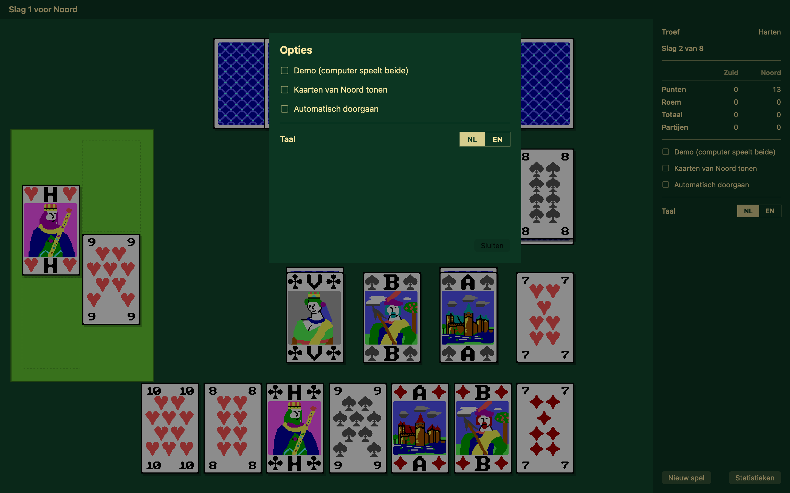

# Klaverjas

Klaverjas for two players, instead of four, against the computer. 

## Dutch text below

Originally written in Turbo C for DOS, now rebuilt as a Windows 11 desktop program in C# and as a Swift app for iPad, iPhone
and Mac. The last ones can be downloaded from the Apple app store for free.

The hand-drawn cards from the 1990 original are still there, pixel for pixel.

## Where it came from

The program was born on a camping holiday in La Guillermie, a village near Vichy in France,
where we played this game every evening after dinner. The hard part was the statistics:
working out the odds that the opponent holds a particular card, with no books at hand.
After buying a calculator that could do factorials the formula was found, and it is still
called *Guilermie* in the source. The cards were drawn on millimetre paper with coloured
pencils in the sun; the first version of the program followed at home in September 1990.

## The game

Klaverjas is normally played by four players. In this two-player variant the third and fourth
player's cards lie on the table: eight per side, four face up with four face down beneath
them. You play for yourself and for your table.

Trumps are chosen first, and the computer decides at random who leads. The opening card
may come from your hand or from the table, but the reply must come from the table — so a
trick runs hand, table, table, hand or table, table, hand, hand.

## Ranking

| | Order (high → low) |
|---|---|
| Trump | J 9 A 10 K Q 8 7 |
| Other suits | A 10 K Q J 9 8 7 |

**Rule:** You must follow suit. If you cannot, you must trump. If trump was led, you must play higher if possible.

## Card Points

| Card | Non-trump | Trump |
|---|---|---|
| A | 11 | 11 |
| 10 | 10 | 10 |
| K | 4 | 4 |
| Q | 3 | 3 |
| J | 2 | 10 |
| 9 | 0 | 14 |
| 8 | 0 | 0 |
| 7 | 0 | 0 |

## Meld

| Combination | Points |
|---|---|
| 3-card sequence (any suit) | 20 |
| 4-card sequence (any suit) | 50 |
| Four of a kind | 100 |
| King + Queen of trumps | 20 |
| Last trick | +10 |
| All tricks (own side chose trumps) | +100 |
| All tricks (opponents chose trumps) | +200 |

**Match target:** 1500 points

The cards keep their Dutch letters: **A**as, **H**eer, **V**rouw, **B**oer — ace, king,
queen, jack.

## Two computer players

You can pick who plays each side, and watch them play each other:

- **Ed** — the rules of thumb from the original program, with the Guilermie odds.
- **Loggen** — R. Loggen's version, which searches the trick through instead of judging it.

They are close. Loggen wins slightly more deals (about 51%) because he plays for meld;
Ed is ahead on raw card points. *Options → Fast play without cards* runs them against each
other with no drawing at all, a few thousand deals a second, and the statistics screen
shows how it adds up.

## Running it

The finished program is in `Klaverjas-app/` — a single self-contained `Klaverjas.exe` that
needs nothing installed. 
It starts in the default language of your system. This can be changed between Dutch and English in the program.

# Klaverjas

| Nederlands | English |
|---|---|
| Dit is een klaverjasspel voor twee spelers geschreven in Turbo C++. Het programma is geboren op vakantie in het Franse plaatsje La Guillermie. Daar werd na veel ploeteren een kansfunctie uitgedacht die de kans op een of meer kaarten bij de tegenstander kon berekenen, bij dit klaverjasspel, wat wij elke avond na het eten speelden. In het zonnetje werden de kaarten getekend en bij thuiskomst werd de eerste start voor dit programma gemaakt (Sept 1990). Het programma is geschreven voor een VGA display, maar EGA en Hercules kunnen ook. Bij EGA en Hercules vallen de onderste kaarten iets van het scherm af en wordt de laatste slag en de slagvolgorde niet meer aangegeven. | This program was made to play Klaverjas against the computer. I played it a lot on holidays and thought it was nice to make a computer version of the game. A lot of time was spent to recall the statistics to calculate the odds that the opponent had a card (e.g. 10 clubs) in his hand. We were on holiday and had no books. After buying a calculator, that could calculate factorials, the formulae was found and called Guilermie, after the village La Guillermie near Vichy in France where we were camping. The cards were designed on paper with millimeter squares with colored pencils and eventually the holiday was over. Making the program was not as easy as I initially thought, but after several months the program worked and here is the result. The game is a typical Dutch game but the rules may be found in specialized card game books. Normally the game is played with four players. The cards of the third and the fourth player are laid down on the table, four open and four closed. The cards first played may be from the table or the hand, the second card, played by the opponent, must be played from the table. So you are playing for yourself and the third person. The computer plays the opponent and the fourth player. |
| Het programma werkt als volgt: Er zijn 8 kaarten in de hand en 8 kaarten op tafel waarvan vier dicht onder de open kaarten voor elke speler. Er moet eerst troef gekozen worden. De computer bepaalt willekeurig wie begint. De uitkomst mag uit de hand of van tafel, maar daarna moet vanaf de tafel gespeeld worden. De laatste slag is weer uit de hand van de tegenspeler. Dus hand, tafel, tafel, hand of tafel, tafel, hand, hand. | The program works like this: There are 8 cards in hand and 8 cards on the table, with four face-down cards under the face-up ones for each player. Trump must be chosen first. The computer randomly decides who starts. You can play from your hand or from the table first, but after that, you have to play from the table. The last trick is again played from the opponent's hand. So hand, table, table, hand or table, table, hand, hand. |
| De kaartslagvolgorde bij troef is: B 9 A T H V 8 7. De niet troefkaarten hebben de volgorde: A T H V B 9 8 7. Je moet de kleur bekennen die gevraagd wordt. Heb je die kleur niet dan moet je troeven. Als er troef wordt gevraagd moet de volgende troefkaart die gespeeld wordt hoger zijn indien mogelijk. Is er geen troef meer dan mag een andere kaart worden geworpen.  De punten telling gaat als volgt A=11, T=10, H=4, V=3, B=2, en de rest (9, 8 en 7) nul punten. Bij troef kaarten geldt: B=10, 9=14, A=11, T=10, H=4, V=3 en de 8 en 7 geen punten.  Er zijn ook roempunten te behalen. Als er een 'driekaart' valt, dwz. drie opeenvolgende kaarten van de volgende volgorde A H V B T 9 8 7, bijv. HVB of BT9, dan worden er 20 punten bij degene die de slag haalt bijgeteld. Een vierkaart, bijv. HVBT of AHVB levert 50 punten op. Vier dezelfde kaarten, bijv. HHHH van de vier kleuren levert 100 punten extra op. (Helaas een bug en als dit valt geen punten) Bij troef is er nog 'het stuk', nl. HV, dit levert 20 punten extra op. De laatste slag levert 10 punten roem op. Zijn alle punten bij een speler gevallen (152+10) dan krijgt deze speler 100 punten extra. Is deze speler niet degene die troef heeft gemaakt, dan nog eens 100 punten extra. Na een slag moet een toets of mousebutton gedrukt worden om de volgende slag te spelen. Een spel is beëindigd bij 1500 punten. | The card ranking order for trump is: J 9 A 10 K Q 8 7. The non-trump cards have the order: A 10 K Q J 9 8 7. You must follow the suit that is asked for. If you don't have that suit, you must play a trump. If a trump is asked for, the next trump card played must be higher if possible. If there are no more trumps, you can play another card.  The points are counted as follows: A=11, 10=10, K=4, Q=3, J=2, and the rest (9, 8, and 7) score zero points. For trump cards: J=10, 9=14, A=11, 10=10, K=4, Q=3, and 8 and 7 score no points.  You can also earn bonus points. If a 'three-card' comes up, i.e., three consecutive cards in the following order A K Q J 10 9 8 7, e.g., KQJ or J 10 9, then 20 points are added for the player who wins the trick. A four-card, e.g., KQJ10 or AKQJ, gives 50 points. Four of the same card, e.g., KKKK from all four suits, gives an extra 100 points. (Unfortunately, a bug exists, so if this happens no points are awarded) With trump there is also 'the piece', namely KQ, which gives an extra 20 points. The last trick gives 10 bonus points. If all points have gone to one player (152+10), that player gets an extra 100 points. If that player didn't make trump, then another 100 points is added. After a trick, a key or mouse button must be pressed to play the next trick. A game ends at 1500 points. |
| Veel succes en probeer maar van dit spel te winnen. | Good luck, and try to win this game. |

Ed Nieuwenhuys

---

©2026 Ed Nieuwenhuys — [ednieuw.nl](https://ednieuw.nl)
